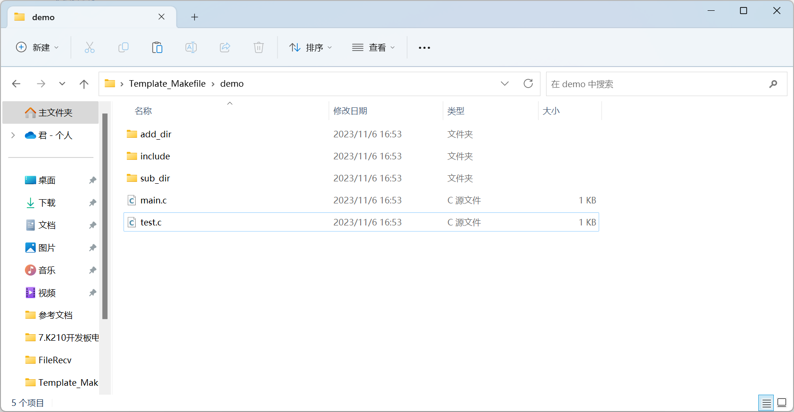
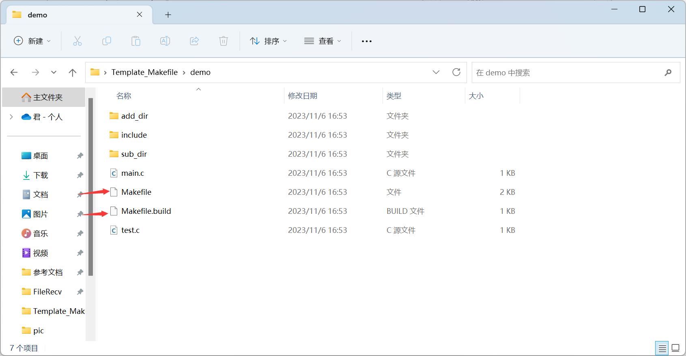
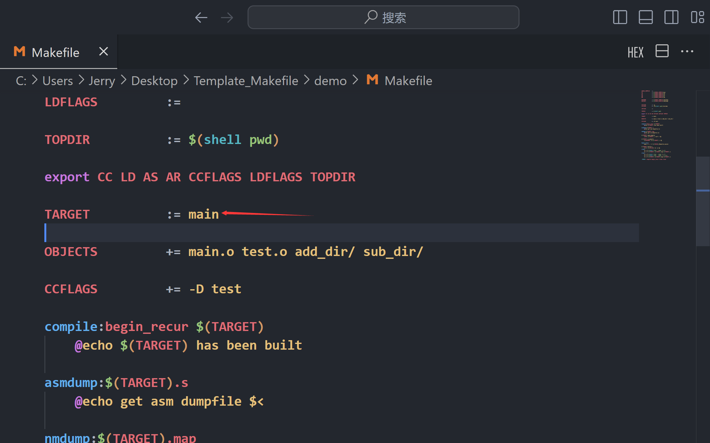
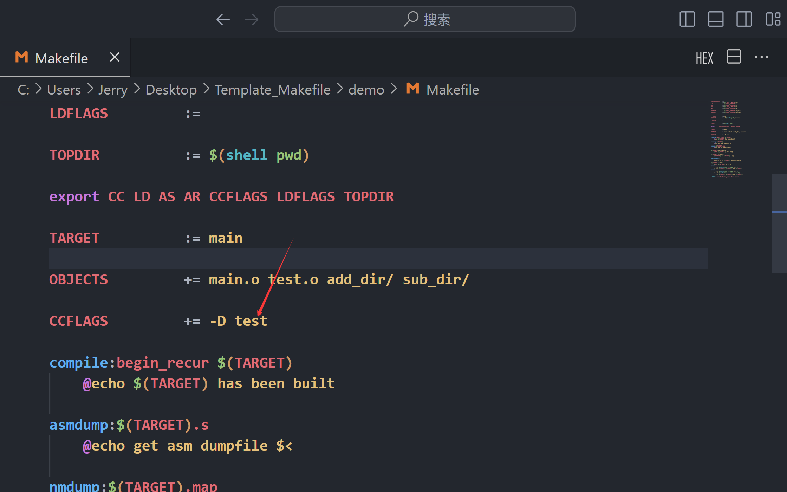
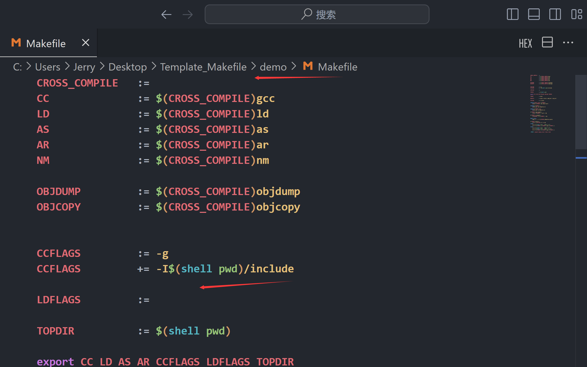
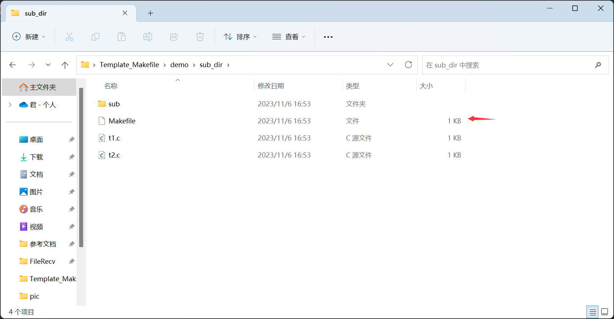
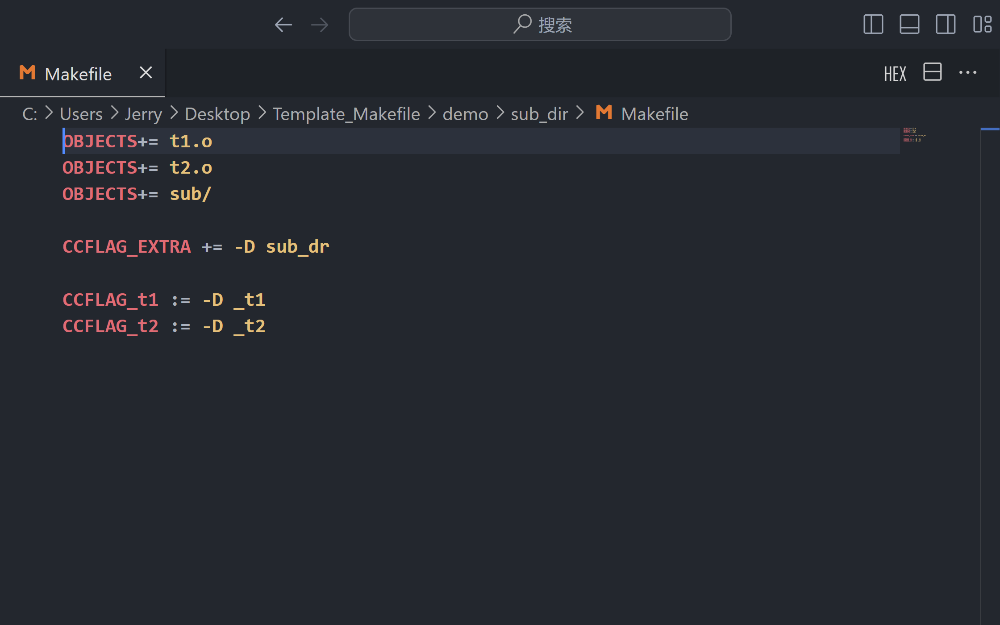

# 用户使用说明

[TOC]

## 使用说明

### 1. 项目添加Makefile 和 Makefile.build 

- 将源代码**src**目录下的Makefile 和 Makefile.build添加到项目的根目录 [顶层目录]
- 以demo为示例
- 添加Makefile 和 Makefile.build之前的项目结构
- 
- 添加Makefile 和 Makefile.build之后的项目结构
- 

### 2. 修改顶层目录的Makefile文件

- 由图片可知,在顶层目录中需要编译的源文件为 `main.c` , `test.c` , 包含源文件的目录为 `add_dir` , `sub_dir`
- 在Makefile文件中将源文件和源文件目录添加到 `OBJECTS变量` 中去 , 如源文件 `main.c` 对应应该添加 `main.o` 到 `OBJECTS变量`中,源文件目录 `add_dir` 对应应该添加 `add_dir/` 到 `OBJECTS变量` 中去。对应修改如下
- 
-   修改`TARGET变量` 可以指定生成目标可执行文件的名字
- 
- 顶层目录中Makefile文件的`CCFLAGS变量`可以为所有源C文件添加编译选项
- 
- 可以在顶层目录中的Makefile中的 `CROSS_COMPILE变量` 指定对应的编译器 `LDFLAGS变量` 指定链接选项
- 

### 3. 在子目录添加Makefile [空白Makefile]并修改

- 下图为顶层目录中的子目录`sub_dir` 的结构,其中Makefile 为使用如`touch` 等命令创建空白的Makefile 而不是顶层目录中的Makefile [也就是项目中 **`src`** 目录下的Makefile]
- 
- 在非顶层目录中的Makefile中，只需要牵涉到三个变量，分别是 `OBJECTS变量` `CCFLAG_EXTRA变量` `CCFLAG_目标名变量`
- 如在 `sub_dir` 目录中 ,需要编译源文件 `t1.c` ,`t2.c` , 源文件目录为`sub` 
- 如下，我需要将其加入`OBJECTS变量` 
- 
- 可以通过添加 `CCFLAG_EXTRA变量` 的值来指定当前目录下的源C文件的编译选项 [编译选项不会作用到当前目录下的子目录]
- 可以通过 `CCFLAG_目标名`的格式，为某个文件打指定编译选项
- 如上图所示， 当前目录下需要编译的源C文件为 `t1.c` , 可以指定 `CCFLAG_t1` 为 `t1.c` 添加编译选项

### 4. 按照上述步骤为所有子目录添加Makefile

- 按照上述为顶层目录的所有子目录添加Makefile
- 如果子目录中又包含有子目录，也任然需要按照格式添加Makefile
- **注意 :  OBJECTS变量 中添加目录项应该以 "/" 结尾 , 同时所有目录项应该为当前目录下的直系子目录,不能为子目录下的子目录**
- **如 , 对于demo 示例 , 顶层Makefile 中的目录项不能包含有 `sub_dir/sub/` 这个选项 , 即使这个目录真实存在**

## 用户使用命令

- 下述操作需要在`顶层目录`中进行
- 使用的时候应该保证按照用户使用说明完成各个目录的Makefile的编写
- 使用 `make ` 进行编译

```shell
make
```


- 使用 `make asmdump` 编译并生成反汇编文件

```shell
make asmdump
```


- 使用 `make asmnm` 编译并生成map文件 

```shell
make nmdump
```


- 使用 `make clean` 清理目标文件

```shell
make clean
```


- 使用 `make clear` 彻底清理清理目标文件，只保留源文件

```shell
make clear
```

